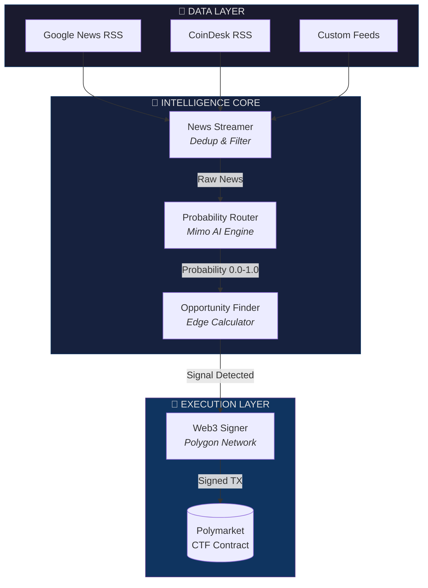

<div align="center">


# 🎯 PREDICTIVE SNIPER

### *Fully Autonomous On-Chain Prediction Market Agent*
### *Powered by Xiaomi Mimo AI*

<br/>

[](https://platform.xiaomimimo.com/)
[](https://www.python.org)
[](https://polygon.technology/)
[](https://web3py.readthedocs.io/)
[](LICENSE)

<br/>

<p align="center">
  <a href="#-overview">Overview</a> •
  <a href="#-key-features">Features</a> •
  <a href="#%EF%B8%8F-architecture">Architecture</a> •
  <a href="#-quick-start">Quick Start</a> •
  <a href="#-configuration">Configuration</a> •
  <a href="#-how-it-works">How It Works</a> •
  <a href="#-disclaimer">Disclaimer</a>
</p>

<br/>


</div>

---

<br/>

## 🧬 Overview

**PREDICTIVE SNIPER** is a zero-touch, low-latency CLI daemon engineered to detect and exploit **mispriced events** on decentralized prediction markets (Polymarket / CTF-based platforms).

By leveraging the advanced reasoning capabilities of **Xiaomi Mimo AI**, this autonomous agent processes real-time global news streams, estimates event probabilities with machine-level precision, and executes Web3 transactions when the AI's confidence significantly diverges from market consensus — capturing alpha before the crowd.

<br/>

> 💡 **The Edge:** While human traders react in minutes, PREDICTIVE SNIPER identifies mispricing in *milliseconds* — combining NLP comprehension with automated on-chain execution for maximum speed advantage.

<br/>

<div align="center">

| Metric | Value |
|--------|-------|
| ⚡ Latency | < 2s per signal |
| 🎯 Min Edge | 20% divergence |
| 🧠 AI Tiers | 3-level fallback |
| 🔗 Network | Polygon (L2) |
| 💰 Position Sizing | Kelly Criterion |

</div>

---

<br/>

## 🔥 Key Features

<table>
<tr>
<td width="50%">

### 🧠 Multi-Tier AI Brain
- **Tier 1:** Xiaomi Mimo Platform (`mimo-v1`)
- **Tier 2:** Groq LLaMA 3 (70B) fallback
- **Tier 3:** Safe neutral default (0.5)
- Ensures 100% uptime with automatic failover

</td>
<td width="50%">

### 📡 Real-Time Ingestion
- Multi-feed RSS aggregation
- Automatic deduplication engine
- Configurable polling intervals
- Graceful error handling per feed

</td>
</tr>
<tr>
<td width="50%">

### ⚖️ Smart Evaluator
- Mathematical edge detection
- Bidirectional analysis (YES & NO sides)
- Kelly Criterion position sizing
- Confidence classification (HIGH/MED/LOW)

</td>
<td width="50%">

### 🔗 Web3 Execution
- Native Polygon transaction signing
- Built-in simulation mode for testing
- Gas estimation & nonce management
- Zero human intervention required

</td>
</tr>
</table>

---

<br/>

## 🏗️ Architecture

<div align="center">



</div>

---

<br/>

## 📁 Project Structure

```
PREDICTIVE-SNIPER/
├── 📄 main.py              → Main orchestrator & entry point
├── 📁 core/
│   ├── __init__.py         → Package metadata (v1.0.0)
│   ├── 🧠 brain.py        → AI probability router (Mimo + Groq)
│   ├── ⚖️ evaluator.py    → Market edge detection & Kelly sizing
│   ├── 🔗 execution.py    → Web3 transaction signing & broadcasting
│   └── 📡 ingestion.py    → RSS feed streaming & deduplication
├── 📄 requirements.txt    → Pinned Python dependencies
├── 📄 .env.example        → Environment variable template
└── 📄 .gitignore          → Git exclusion rules
```

---

<br/>

## 🚀 Quick Start

### Prerequisites

- Python 3.10+
- Xiaomi Mimo API Key ([Get one here](https://platform.xiaomimimo.com/))
- Polygon RPC endpoint (Alchemy / Infura)
- Private key for transaction signing

### Installation

```bash
# 1. Clone the repository
git clone https://github.com/fauzi69/PREDICTIVE-SNIPER.git
cd PREDICTIVE-SNIPER

# 2. Create virtual environment
python -m venv venv
source venv/bin/activate  # Linux/Mac
# venv\Scripts\activate   # Windows

# 3. Install dependencies
pip install -r requirements.txt

# 4. Configure environment
cp .env.example .env
nano .env  # Fill in your API keys

# 5. Launch the agent
python main.py
```

### Expected Output

```
╔══════════════════════════════════════════════════════════════╗
║              🎯 PREDICTIVE SNIPER v1.0.0                     ║
║         Autonomous Prediction Market Agent                   ║
╚══════════════════════════════════════════════════════════════╝

2025-01-15 14:30:01 | INFO     | Predictive Sniper is LIVE. Scanning markets...
2025-01-15 14:30:01 | WARNING  | ⚠️  SIMULATION MODE ACTIVE - No real transactions will be sent.
2025-01-15 14:30:03 | INFO     | [SCAN] Processing: Trump leads in latest polling data from...
2025-01-15 14:30:04 | INFO     | [BRAIN:MIMO] Probability: 0.720
2025-01-15 14:30:04 | INFO     | [EVALUATOR] SIGNAL DETECTED: YES | Edge: 22.0% | Confidence: LOW
2025-01-15 14:30:04 | INFO     | [✓ EXECUTED] YES | Edge: 22.0% | Size: $220.0 | TX: 0xSIM_https://news...
```

---

<br/>

## ⚙️ Configuration

### Environment Variables

| Variable | Required | Description | Default |
|----------|:--------:|-------------|---------|
| `MIMO_API_KEY` | ✅ | Xiaomi Mimo Platform API key | — |
| `MIMO_BASE_URL` | ❌ | Mimo API base URL | `https://api.xiaomimimo.com/v1` |
| `MIMO_MODEL` | ❌ | Mimo model identifier | `mimo-v1` |
| `GROQ_API_KEY` | ❌ | Groq fallback API key | — |
| `POLYGON_RPC` | ✅ | Polygon RPC endpoint URL | — |
| `PRIVATE_KEY` | ✅ | Wallet private key | — |
| `SIMULATION_MODE` | ❌ | Enable/disable simulation | `true` |

### Agent Parameters

| Parameter | Location | Description | Default |
|-----------|----------|-------------|---------|
| `min_margin` | `main.py` | Minimum edge to trigger trade | `0.20` (20%) |
| `max_exposure` | `main.py` | Max USDC per trade | `$500` |
| `poll_interval` | `main.py` | RSS check frequency | `15s` |

---

<br/>

## 🔄 How It Works

```
┌─────────────────────────────────────────────────────────────────┐
│                     PREDICTIVE SNIPER PIPELINE                   │
├─────────────────────────────────────────────────────────────────┤
│                                                                   │
│  STEP 1: INGEST         STEP 2: ANALYZE        STEP 3: EVALUATE │
│  ┌─────────────┐       ┌─────────────┐       ┌─────────────┐   │
│  │ RSS Feeds   │──────▶│ Mimo AI     │──────▶│ Edge Calc   │   │
│  │ (3 sources) │       │ Probability │       │ Kelly Size  │   │
│  └─────────────┘       └─────────────┘       └──────┬──────┘   │
│                                                       │          │
│                         STEP 4: EXECUTE               ▼          │
│                        ┌─────────────┐       ┌─────────────┐   │
│                        │ Polygon TX  │◀──────│ Signal?     │   │
│                        │ Broadcast   │  YES  │ Edge ≥ 20%  │   │
│                        └─────────────┘       └─────────────┘   │
│                                                                   │
└─────────────────────────────────────────────────────────────────┘
```

### Decision Logic

1. **Ingestion** — Continuously streams news from Google News, CoinDesk, and configurable RSS feeds
2. **Analysis** — Each headline is sent to Mimo AI for probability estimation (0.0 → 1.0)
3. **Evaluation** — Compares AI probability vs current market price. If divergence ≥ 20%, a signal is generated
4. **Execution** — Calculates position size via Kelly Criterion and signs the transaction on Polygon

---

<br/>

## 🛡️ Safety Features

| Feature | Description |
|---------|-------------|
| 🧪 **Simulation Mode** | Default ON — no real money at risk during testing |
| 🔒 **Private Key Isolation** | Keys loaded from `.env`, never hardcoded |
| 📊 **Position Sizing** | Conservative half-Kelly prevents over-exposure |
| 🚫 **Max Exposure Cap** | Hard limit on per-trade USDC amount |
| 🔄 **Graceful Shutdown** | SIGINT/SIGTERM handlers for clean exit |
| 📝 **Full Logging** | Complete audit trail of all decisions |

---

<br/>

## 🗺️ Roadmap

- [ ] Live Polymarket API integration for real market prices
- [ ] Multi-market parallel scanning
- [ ] Discord/Telegram alert notifications
- [ ] Historical backtest engine
- [ ] Portfolio tracking dashboard
- [ ] Dynamic margin adjustment based on win rate
- [ ] Support for additional prediction markets (Augur, Azuro)

---

<br/>

## 🤝 Contributing

Contributions are welcome! Here's how to get involved:

```bash
# Fork the repo and create your branch
git checkout -b feature/amazing-feature

# Make your changes and commit
git commit -m "feat: add amazing feature"

# Push and open a PR
git push origin feature/amazing-feature
```

---

<br/>

## ⚠️ Disclaimer

<div align="center">

> **⚠️ IMPORTANT: USE AT YOUR OWN RISK**

</div>

This software is provided **"as is"** for educational and research purposes only. 

- This is **NOT** financial advice. Prediction markets involve significant financial risk.
- **Never** trade with money you cannot afford to lose.
- The authors are **NOT** responsible for any financial losses incurred from using this software.
- Always run in `SIMULATION_MODE=true` until you fully understand the system.
- Ensure compliance with all applicable laws and regulations in your jurisdiction.
- Prediction market participation may be restricted or illegal in certain regions.

---

<br/>

<div align="center">

## 📜 License

Released under the [MIT License](LICENSE).

<br/>

---

<br/>

**Built with 🧠 AI and ⚡ Speed**

<sub>Powered by Xiaomi Mimo AI Platform | Running on Polygon Network</sub>

<br/>

[](https://github.com/fauzi69/PREDICTIVE-SNIPER)
[](https://github.com/fauzi69/PREDICTIVE-SNIPER)

</div>
